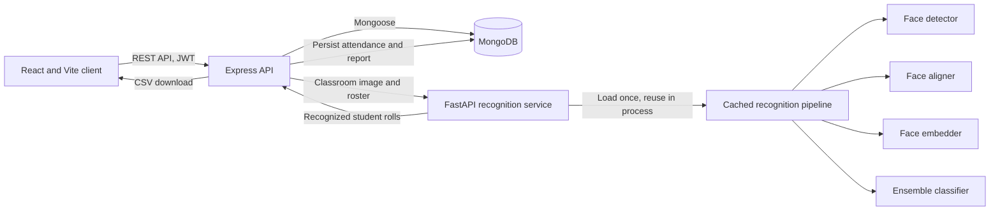

# Automated Attendance System

A full-stack classroom attendance platform that uses face recognition to identify students in classroom images, records attendance, and provides downloadable reports. The system separates the web application from the computer-vision workload so each part can be developed and operated independently.

## Contents

- [Overview](#overview)
- [Features](#features)
- [Architecture](#architecture)
- [Face pipeline lifecycle optimization](#face-pipeline-lifecycle-optimization)
- [Technology stack](#technology-stack)
- [Repository layout](#repository-layout)
- [Prerequisites](#prerequisites)
- [Local setup](#local-setup)
- [Configuration](#configuration)
- [How attendance processing works](#how-attendance-processing-works)
- [Main API routes](#main-api-routes)
- [Important model and data notes](#important-model-and-data-notes)
- [Troubleshooting](#troubleshooting)
- [Limitations and future work](#limitations-and-future-work)

## Overview

Manual roll calls consume class time and can lead to recording errors. This application provides an image-based attendance workflow: administrators load teacher and student records, teachers manage their assigned classes, and the recognition service determines which roster members appear in uploaded classroom images. The backend saves the result and makes it available through attendance history and CSV reports.

The repository has three main runtime parts:

1. **React web client** for authentication, dashboards, student identity setup, attendance capture, history, and administration.
2. **Node.js/Express API** for authentication and authorization, class and student data, attendance persistence, CSV import, and report downloads.
3. **Python/FastAPI recognition service** for image decoding and face detection, alignment, embedding, and classification.

MongoDB stores users, classes, students, and attendance records.

## Features

- Teacher login and registration, JWT access tokens, refresh-token cookies, and protected API routes.
- Role-aware administrator workflows for importing teacher and student rosters from CSV.
- Class dashboard with roster counts, recent attendance, and identity-mapping readiness.
- Student-to-classifier identity mapping, with known model identities available as suggestions.
- Attendance processing from one or more classroom images.
- Duplicate suppression: a student recognized across multiple images is counted once in the attendance session.
- Attendance history and downloadable CSV reports.
- A separate recognition API, keeping computer-vision dependencies out of the Express request process.

## Architecture



The Express service owns application concerns and calls the Python service for recognition. The Python service validates/decodes the submitted image, invokes the recognition adapter, and returns attendance statuses. The Node API then stores the attendance against the selected class and teacher. The browser communicates with the Node API; it does not connect directly to MongoDB.

## Face pipeline lifecycle optimization

A significant architectural fix was moving the expensive recognition components into a process-wide, in-memory pipeline instead of reconstructing them for every recognition request.

In `backend/src/services/cv_adapter.py`, `_get_pipeline()` lazily creates one `FriendModelPipeline` and stores it in the module-level `_PIPELINE`. A thread lock protects initialization, so concurrent first requests cannot construct duplicate pipelines. The pipeline owns the detector, aligner, embedder, and loaded classifier, and later requests reuse those same instances.

The FastAPI startup hook calls `warmup_model()`, which goes through the same singleton accessor. This loads and validates the model assets during service startup, moving initialization cost out of the first classroom attendance request. The practical result is less repeated model loading and reduced per-request latency and memory churn.

**Scope:** the cache is per Python process, not shared across machines or multiple worker processes. Each worker process loads its own pipeline into memory. A restart or deployment reload creates a new pipeline. Startup fails if required assets or model dependencies are unavailable, which makes configuration problems visible early.

## Technology stack

| Area | Technologies |
| --- | --- |
| Frontend | React, Vite, React Router, Axios, Tailwind CSS, CSS Modules |
| Main API | Node.js, Express, Mongoose, Joi, Multer, csv-parser, csv-writer |
| Recognition API | Python, FastAPI, OpenCV, NumPy, InsightFace, ONNX Runtime, scikit-learn, Ultralytics |
| Database | MongoDB |
| Authentication | JWT, bcryptjs, HTTP-only refresh-token cookie |

## Repository layout

```text
backend/
  index.js                   Express API entry point
  db.js                      MongoDB connection
  src/
    app.js                   Express middleware and route mounting
    controllers/              API and attendance logic
    models/                   Mongoose models
    routes/                   REST route definitions
    services/
      cv_adapter.py           Recognition pipeline and in-memory cache
      face_service.py        FastAPI recognition endpoints and startup warmup
      friend_model/           Detector, aligner, embedder, classifier
  models/                     Detector weights, classifier, and embedding models
frontend/
  src/                        React application
hf-face-service/              Container/deployment assets for the face service
```

## Prerequisites

- Node.js and npm.
- Python 3 and pip. The recognition dependencies include compiled computer-vision and machine-learning packages; use a supported Python version for the pinned dependencies.
- A MongoDB instance, local or hosted, and a MongoDB connection URI.
- The recognition model assets. The repository currently includes the detector weights, classifier artifact, and InsightFace model files under `backend/models/`.

## Local setup

Run each service in its own terminal from the repository root.

### 1. Configure the backend

```powershell
cd backend
Copy-Item .env.example .env
```

Edit `backend/.env` and set at least:

- `MONGODB_URI` to your MongoDB connection string.
- `JWT_SECRET` and `JWT_REFRESH_SECRET` to private, random values.
- `FACE_SERVICE_URL=http://localhost:5001` for the local face-service command below.
- `ADMIN_EMAILS` to the email address or comma-separated addresses that should have administrator access.

Do not commit `.env` or put real credentials in documentation.

Install dependencies and start the Express API:

```powershell
npm install
npm run dev
```

The API uses `PORT` if configured; otherwise it listens on port `5000`. It connects to MongoDB before it begins listening.

### 2. Install and start the recognition service

In a second terminal:

```powershell
cd backend
python -m venv .venv
.\.venv\Scripts\Activate.ps1
python -m pip install --upgrade pip
python -m pip install -r requirements.txt
npm run start:face
```

The face service starts with Uvicorn on `http://localhost:5001`. On the first run, InsightFace may need to download model assets if the configured local model directory is incomplete. The service expects the detector and classifier artifacts to exist at the configured paths; by default, those are `backend/models/yolov8n-face.pt` and `backend/models/classifier.pkl`.

If PowerShell blocks virtual-environment activation, use an approved activation policy for your machine or invoke the environment's Python directly, for example `backend\.venv\Scripts\python.exe -m pip install -r backend\requirements.txt` from the repository root.

### 3. Configure and start the frontend

In a third terminal:

```powershell
cd frontend
npm install
```

Create `frontend/.env` with the API address:

```env
VITE_API_URL=http://localhost:5000
```

Then start Vite:

```powershell
npm run dev
```

Open the local URL printed by Vite, typically `http://localhost:5173`.

### Optional checks

From `frontend/`:

```powershell
npm run lint
npm run build
```

The backend package currently does not define an automated test suite.

## Configuration

### Backend environment variables

| Variable | Purpose | Local development value/example |
| --- | --- | --- |
| `PORT` | Express API port | `5000` |
| `MONGODB_URI` | MongoDB connection URI | `mongodb://localhost:27017/attendance` |
| `JWT_SECRET` | Signs access tokens | Use a private random value |
| `JWT_REFRESH_SECRET` | Signs refresh tokens | Use a different private random value |
| `NODE_ENV` | Runtime mode and cookie behavior | `development` |
| `CORS_ORIGINS` | Allowed browser origins, comma-separated | `http://localhost:5173` |
| `COOKIE_SAMESITE` | Refresh cookie SameSite mode | `lax` |
| `COOKIE_SECURE` | Require HTTPS for cookies | `false` for local HTTP |
| `ADMIN_EMAILS` | Emails authorized for admin CSV operations | `admin@example.com` |
| `FACE_SERVICE_URL` | FastAPI service base URL used by Express | `http://localhost:5001` |
| `FACE_SERVICE_TIMEOUT_MS` | Recognition request timeout in milliseconds | Default is `180000` |
| `FACE_DETECTOR_WEIGHTS_PATH` | Face detector weights path | `models/yolov8n-face.pt` |
| `FACE_CLASSIFIER_PATH` | Trained classifier file path | `models/classifier.pkl` |
| `FACE_EMBEDDER_DIR` | Local InsightFace model directory | `models/insightface/buffalo_l` |

The backend's fallback face-service URL is `http://127.0.0.1:8000`, while `npm run start:face` binds port `5001`. Set `FACE_SERVICE_URL` to port `5001` when using the included local command.

The face service also accepts `FACE_SERVICE_CORS_ORIGINS`, `FACE_MODEL_MODULE`, and `FACE_MODEL_FUNCTION` for CORS and adapter selection. Defaults are configured in `backend/src/services/face_service.py`.

## How attendance processing works

1. An administrator imports teacher and student records from CSV.
2. A teacher signs in and opens an assigned class.
3. The teacher checks the roster and maps each student to the matching trained model identity where needed.
4. The teacher submits one or more classroom images for attendance.
5. Express sends the image data and class roster to the Python recognition service.
6. Python decodes the image, detects faces, aligns each detected face, generates embeddings, and classifies them against the loaded model. Unknown predictions are not counted as recognized students.
7. Recognized model identities are normalized and mapped to student roll numbers from the selected class roster. Multiple appearances of the same roll number are deduplicated.
8. Express records present and absent students in MongoDB and updates the class's latest attendance metadata.
9. The teacher can review attendance history or download the generated CSV report.

## Main API routes

All routes are served by the Express API unless marked as the face service.

| Method | Path | Purpose |
| --- | --- | --- |
| `GET` | `/health` | Express API health check |
| `POST` | `/auth/register` | Register a teacher account |
| `POST` | `/auth/login` | Authenticate and issue tokens |
| `GET` | `/auth/me` | Get the authenticated user |
| `GET` | `/auth/refresh` | Refresh the access token using the refresh cookie |
| `POST` | `/auth/logout` | Clear the refresh-token session |
| `POST` | `/csv/upload-teachers` | Admin-only teacher CSV import |
| `POST` | `/csv/upload-students` | Admin-only student CSV import |
| `GET` | `/dashboard/classes` | Get the teacher's classes |
| `GET` | `/dashboard/recent-attendance` | Get recent attendance |
| `GET` | `/students/class/:classId` | Get students in a class |
| `GET` | `/students/model-identities` | List known classifier identities |
| `PUT` | `/students/:studentId/model-identity` | Update a student's classifier identity mapping |
| `POST` | `/attendance/take` | Process and save attendance |
| `GET` | `/attendance/report/:attendanceId` | Download an attendance report |

The Python service provides `GET /health`, `GET /identities`, and `POST /recognize` on port `5001` in the local setup.

## Important model and data notes

- Student records need to belong to the selected class, and the model identity must correspond to a label in the imported classifier for direct recognition.
- If a student's classifier label differs from their roster name, use the model-identity mapping in the application.
- Image quality, lighting, face size, pose, occlusion, and the trained model affect recognition results. Review the saved records as part of operational use.
- Keep model files and student images private and follow applicable consent, retention, and access-control requirements.
- The migration utility `backend/scripts/migrate-imported-raw-students.mjs` supports conversion of older imported student records to the current class-linked structure. Review its usage and back up the database before running migrations.

## Troubleshooting

- **Express cannot connect to MongoDB:** confirm `MONGODB_URI`, network access, and database credentials.
- **Attendance says the recognition service is unavailable:** start the Python service and set `FACE_SERVICE_URL=http://localhost:5001` in `backend/.env`; restart Express after changing environment values.
- **Face service fails during startup:** check Python dependency installation and confirm detector weights, classifier file, and embedding model directory exist at their configured paths.
- **No class identities match the model:** inspect the classifier's known identities and correct the students' model-identity mappings. Matching is based on normalized identity labels.
- **Browser API calls fail due to CORS:** add the exact Vite origin to `CORS_ORIGINS` in the backend environment, then restart the API.
- **Refresh cookies do not work locally:** use the local HTTP cookie settings (`NODE_ENV=development`, `COOKIE_SECURE=false`, `COOKIE_SAMESITE=lax`) and ensure Axios requests include credentials, as configured in the frontend client.

## Limitations and future work

- There is no automated backend test suite configured yet.
- Recognition is based on uploaded still images rather than continuous live camera streaming.
- Accuracy depends on model quality and classroom image conditions; this should not be treated as a substitute for appropriate review and attendance policy.
- Model training/retraining, richer analytics, and deployment/CI documentation can be expanded.
